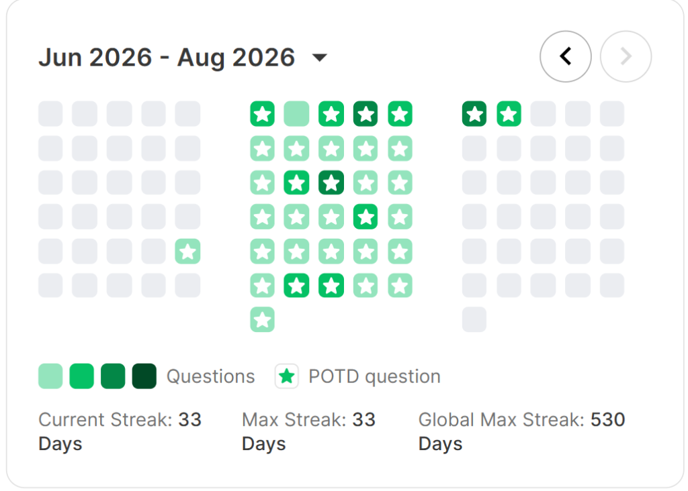

<div align="center">

# 🏆 Unstop 30-Day POTD Challenge 🏆

[](https://python.org)
[]()
[]()

*“Consistency is the bridge between goals and accomplishment.”*

---

### 🌟 Challenge Completed!
This repository documents my daily journey and solutions for the **Unstop 30 Days Problem of the Day (POTD) Challenge**. 
Over 30 consecutive days, I tackled problems covering data structures, dynamic programming, advanced graph algorithms, and competitive programming techniques.

</div>

## 📈 Streak & Progress Statistics

<div align="center">
  
</div>

<br>

<div align="center">

| 📊 Metric | Value |
| :--- | :--- |
| **Total Challenges Solved** | `30 / 30` (100% Completion) |
| **Current / Max Streak** | `33 Days` 🔥 |
| **Primary Language** | Python 3 🐍 |
| **Topics Mastered** | Dynamic Programming, Graph Theory, DSU, Segment Trees, Mo's Algorithm |

</div>

---

## 🛠️ Topic Distribution
Here's a breakdown of the core computer science and algorithmic concepts mastered during this challenge:
* **Advanced Data Structures**: Disjoint Set Union (DSU), Segment Trees (Beats), Queues, Stacks.
* **Dynamic Programming**: Bitmask DP, Path Optimization, Matrix Chain Multiplication (MCM), Longest Increasing Subsequence (LIS).
* **Graph Algorithms**: DFS/BFS, Strongly Connected Components (SCC), Floyd-Warshall (APSP), Traveling Salesman Problem (TSP).
* **Mathematics & Bits**: Greatest Common Divisor (GCD), Least Common Multiple (LCM), Bitwise XOR Operations.
* **String Manipulation**: Palindrome Checking, Custom String Counting.

---

## 🏆 Challenge Tracker

Below is the complete list of daily challenges, topics, and solutions:

| Day | Problem Name & Reference | Key Algorithmic Topics | Code Link |
| :---: | :--- | :--- | :---: |
| **01** | Minimize the range of any k-length window | Sliding Window, Arrays | [Solution 🐍](./day-01) |
| **02** | Valid Partition in Linked List | Linked List, Partitioning | [Solution 🐍](./day-02) |
| **03** | Cycle Detection & Chain Recovery in a Corrupted Linked List | Floyd's Cycle Finding, Linked List | [Solution 🐍](./day-03) |
| **04** | Duplicate Detection in an Array | Arrays, Hash Map/Set | [Solution 🐍](./day-04) |
| **05** | Maximum Crystals with No Two Adjacent Chambers | Dynamic Programming, House Robber | [Solution 🐍](./day-05) |
| **06** | Maximum Checkpoints with Minimum Distance Gap | Greedy, Arrays | [Solution 🐍](./day-06) |
| **07** | Farthest City from the Capital | BFS/DFS, Tree Depth | [Solution 🐍](./day-07) |
| **08** | Find the Unique Registration ID (XOR Trick) | Bit Manipulation, XOR | [Solution 🐍](./day-08) |
| **09** | Top of the Pile (Stack Simulation) | Stack Simulation, Array | [Solution 🐍](./day-09) |
| **10** | Most Frequent Visitor ID (with Tie-Breaking) | Hashing, Frequency Counting | [Solution 🐍](./day-10) |
| **11** | Top K Dispatched Packages (Priority-Based Sorting) | Sorting, Priority Queue / Heap | [Solution 🐍](./day-11) |
| **12** | Minimum Energy Path Across Relay Towers | Dynamic Programming, Pathfinding | [Solution 🐍](./day-12) |
| **13** | Longest Reconstruction Chain | Longest Increasing Subsequence (LIS) | [Solution 🐍](./day-13) |
| **14** | Mirror Mode — Reverse Each Row of a Grid | Matrix, 2D Arrays | [Solution 🐍](./day-14) |
| **15** | Minimum Dream-Energy for Tapestry Weaving | Matrix Chain Multiplication (MCM), DP | [Solution 🐍](./day-15) |
| **16** | Lantern Ceiling Commands | Segment Tree Beats, Range Operations | [Solution 🐍](./day-16) |
| **17** | Minimum Announcers | SCC, Kosaraju/Tarjan, Source Counting | [Solution 🐍](./day-17) |
| **18** | Synchronized Drums | GCD / LCM, Number Theory | [Solution 🐍](./day-18) |
| **19** | Chamber Recovery Sequence | BST, Postorder Traversal | [Solution 🐍](./day-19) |
| **20** | Bridge Waiting Line | Queue Simulation, Arrays | [Solution 🐍](./day-20) |
| **21** | Relay Network Restoration | TSP, Bitmask Dynamic Programming | [Solution 🐍](./day-21) |
| **22** | Emergency Alert Propagation | BST, Level Order Traversal | [Solution 🐍](./day-22) |
| **23** | Sacred Crystal Guardian Pairing | Bitmask DP, Max Weight Perfect Matching | [Solution 🐍](./day-23) |
| **24** | Beacon Synchronization Energy | Mo's Algorithm, Offline Range Queries | [Solution 🐍](./day-24) |
| **25** | Mirror Word Check | Strings, Palindromes | [Solution 🐍](./day-25) |
| **26** | Interdimensional Trade Routes | Floyd-Warshall, Graph APSP | [Solution 🐍](./day-26) |
| **27** | Code Letter Counter | String Counting, HashMap | [Solution 🐍](./day-27) |
| **28** | The Missing Preservation Entry | Bit Manipulation, XOR | [Solution 🐍](./day-28) |
| **29** | Subtree Score Spread | Tree DFS/BFS, Subtree Aggregation | [Solution 🐍](./day-29) |
| **30** | Currency Exchange Consistency | Weighted Union-Find (DSU) | [Solution 🐍](./day-30) |

---

## 🚀 How to Run the Solutions

Each day contains its own Python script (`solution.py`) and a dedicated `README.md` explaining the problem statement, approach, complexity, and key takeaways.

To run any day's solution, navigate to the folder and run:
```bash
python solution.py < input.txt
```
*(Make sure to create an `input.txt` file or pass inputs via standard input).*

---
<div align="center">
  Made with ❤️ and Consistency.
</div>
